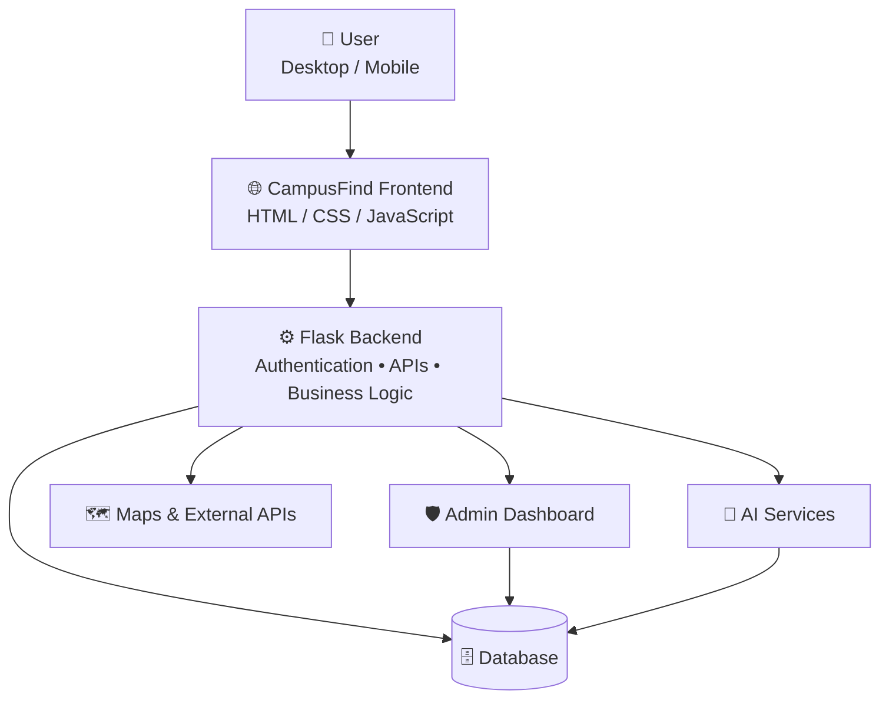

 CampusFind

AI-Powered Smart Campus Discovery & Recovery Platform

CampusFind is a modern, intelligent web platform designed to help students discover, explore, and interact with campus-related resources through a centralized digital experience.

The platform combines **smart search, interactive maps, authentication, dashboards, reporting, and AI-powered features** into a single responsive application.

 Live Application

Live Demo:  
https://campusfind-1-yrgg.onrender.com

 Overview

CampusFind aims to solve a common problem faced by students: finding and accessing useful campus information quickly.

Instead of searching through multiple sources, CampusFind provides a unified platform where users can:

-  Search campus resources
-  Explore locations using an interactive map
-  Create and manage accounts
-  Save useful locations/resources
-  Discover nearby campus facilities
-  Report issues or missing resources
-  Interact with AI-powered features
-  Access personalized dashboards
-  Use secure authentication
-  Allow administrators to manage the platform

The project is designed with a modern, responsive interface and production-ready architecture.

 Key Features

 Authentication & User Management

- User registration
- Secure login
- Logout
- Session management
- User profiles
- Role-based access
- Admin authentication

 Interactive Campus Map

CampusFind provides an interactive map experience allowing users to:

- Explore campus locations
- Find facilities
- View important places
- Navigate campus resources
- Discover nearby locations

 Smart Search & Discovery

Users can quickly search and discover campus resources.

Features include:

- Search
- Filtering
- Categories
- Location-based discovery
- Resource exploration
- Fast navigation

---

 AI-Powered Features

CampusFind integrates AI to provide a smarter user experience.

Potential AI capabilities include:

- Intelligent recommendations
- Smart search assistance
- AI-powered suggestions
- Conversational assistance
- Automated information processing

The AI layer is designed to make campus discovery more interactive and personalized.

 User Dashboard

Users get a personalized dashboard where they can manage their CampusFind activity.

Dashboard functionality includes:

- Profile information
- Saved resources
- Recent activity
- Reports
- Personalized information
- Account management

 Admin Dashboard

Administrators have access to a dedicated management interface.

Admin capabilities include:

- User management
- Resource management
- Report management
- Content moderation
- Platform monitoring
- Analytics
- Administrative controls

Admin-only functionality is protected through role-based authorization.

 Smart Recovery & Reporting

CampusFind includes functionality for reporting campus-related problems or missing resources.

Users can submit reports which can then be reviewed and managed by administrators.

This helps create a community-driven campus information and recovery system.

 Responsive Design

CampusFind is designed to work across:

-  Desktop
-  Laptop
-  Mobile
-  Tablet

The UI adapts to different screen sizes while maintaining a consistent user experience.

 Technology Stack

 Frontend

- HTML5
- CSS3
- JavaScript
- Responsive UI
- Modern UI/UX principles

 Backend

- Python
- Flask

 Database

- SQLite / Production Database

 APIs & Services

- Google Maps API
- AI APIs
- Email services
- REST APIs

 Deployment

- Render
- GitHub

 Development

- Windsurf
- Windsurf AI
System Architecture

